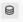
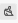
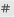
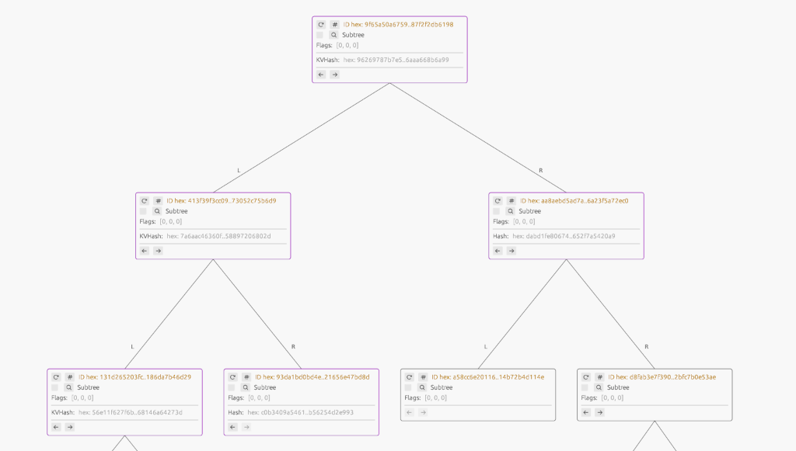

# GroveDBG
_[GroveDB](https://www.grovedb.org/) visualization application_

---

## Accessing GroveDBG

### In the browser

Recent versions of GroveDB include the GroveDBG tool, meaning that if your application uses the GroveDB library with
the `grovedbg` feature enabled and has an instance of it, the current application state is easily accessible via your
web browser:

```rust
let db = Arc::new(GroveDb::open("db")?); // Make sure the handle is `Arc`ed

db.start_visualizer(10000);
```

Then, using a WebGL-compatible browser (basically any modern one), navigate to `localhost` with a chosen port. In the
example above, it's `localhost:10000`.

### Native app

In the case of a native app, the GroveDBG frontend is no longer served by GroveDB itself, so this requires the
GroveDBG code locally. However, this still requires a running GroveDB instance with the `grovedbg` feature and the
`start_visualizer` call to fetch data from.

```
git clone https://github.com/dashpay/grovedbg.git 
cd grovedbg
GROVEDBG_ADDRESS=http://localhost:10000/ cargo run --release
```

As before, this assumes that the GroveDB instance of interest is running locally and the `start_visualizer(port)` call
used `10000` as the port. It's worth pointing out that the usage of GroveDBG is not limited to local instances and is
suitable for remote access as long as all these conditions are met and the port is open for access.

## Usage

### Overview

<details>
  <summary>Whole window screenshot</summary>

  Don't mind this tiny picture; the details are unnecessary. The goal is to show the vertical division into sections and
  count them (there should be 6).

  <picture>
    <source media="(prefers-color-scheme: dark)" srcset="docs/overview_dark.png">
    <source media="(prefers-color-scheme: light)" srcset="docs/overview_light.png">
    
  </picture>
</details>

At the top of the main (and only) GroveDBG window, there is a panel to choose the theme and start a new session. More on
sessions later, but on launch, it will start a new session automatically, so we can do without this button for now.

The rest of the window is far more fascinating: 6 vertically divided sections. We'll name them from left to right with a
brief description; details will follow later:

#### 1. Profiles

A customizable and persistent subsystem to set up shortcuts, aliases, or default byte representations.

#### 2. Query builder

A recursive form to build any query that GroveDB supports. With buttons at the end of the form, the query can be used to
fetch data or to fetch a proof.

#### 3. Proof viewer

If the query builder is used to fetch a proof, it will be shown here. Starting with the root layer, all lower layers can
be expanded as well.

#### 4. Merk view

A view of an individual subtree in the form of a merkelized AVL tree. Because trees can be really big, it starts with
the root node and provides controls to fetch and show child nodes individually.

If the query builder was used to fetch a proof and the chosen subtree is one of the proof layers, then the proof data
will be shown on top of the Merk view, highlighting the Merkle path with a color.

#### 5. Subtree view

While other panels have an arrow on top to hide them, the subtree view is considered the default view and stays visible
at all times. GroveDB is made of subtrees, and the root subtree is the first thing we'll see on GroveDBG startup.

#### 6. Log

A log window.

### Byte representations

At its core, GroveDB uses byte key-value tables arranged in hierarchies, making few assumptions about what this data
means. That's why, to make the most of it, GroveDBG is packed with features to ease the use and investigation of data in
the most sensible way for the user's domain.

Bytes can mean anything, and we give tools to choose how to represent them. By default, GroveDBG uses heuristics to
choose the appropriate display for received bytes, but this can easily be overridden.

This feature is used almost _everywhere_ in the application, which is why we introduce it early. To access it, use
**right mouse click** on any data (key/value/bytes input).

<details>
  <summary>Root subtree with display choice menu</summary>
  <picture>
    <source media="(prefers-color-scheme: dark)" srcset="docs/root_subtree_dark.png">
    <source media="(prefers-color-scheme: light)" srcset="docs/root_subtree_light.png">
    
  </picture>
</details>

### Subtree view

The subtree view is the primary navigation area for GroveDB's structure and remains uncollapsed at all times.

<details>
  <summary>Subtrees example</summary>
  <picture>
    <source media="(prefers-color-scheme: dark)" srcset="docs/subtrees_dark.png">
    <source media="(prefers-color-scheme: light)" srcset="docs/subtrees_light.png">
    
  </picture>
</details>

Each node in this acyclic graph represents an individual subtree within GroveDB. The parent-child relationships are
displayed vertically, with subtrees appearing lower in the hierarchy indicating deeper levels within the HADS. These
nodes consist of vertically split sections.

**Orange** lines illustrate connections between parents and their respective children. 

**Blue** lines represent references, indicating that an item in one subtree is a reference to another item in a
different subtree. Since this is not a parent-child relationship, arrows are used to make the connection more visually
distinct.


#### Controls

1. **10** : Fetch the first 10 items of the subtree.
2. **100** : Fetch the first 100 items of the subtree.
3. <picture>
     <source media="(prefers-color-scheme: dark)" srcset="docs/button_database_dark.png">
     <source media="(prefers-color-scheme: light)" srcset="docs/button_database_light.png">
     
   </picture> : Fetch the entire subtree. Be cautious, as this might be too much data.
4. <picture>
     <source media="(prefers-color-scheme: dark)" srcset="docs/button_fetch_root_dark.png">
     <source media="(prefers-color-scheme: light)" srcset="docs/button_fetch_root_light.png">
     
   </picture> : Fetch the subtree's root node. Since the root node key is inherited from the parent, this button may be
   inaccessible if the fetched part of the parent subtree doesn't include this information.
5. <picture>
     <source media="(prefers-color-scheme: dark)" srcset="docs/button_clear_dark.png">
     <source media="(prefers-color-scheme: light)" srcset="docs/button_clear_light.png">
     
   </picture> : Clear subtree data to save space.
6. <picture>
     <source media="(prefers-color-scheme: dark)" srcset="docs/button_query_dark.png">
     <source media="(prefers-color-scheme: light)" srcset="docs/button_query_light.png">
     
   </picture> : Select this subtree for a path query (more on the query builder later).
7. <picture>
     <source media="(prefers-color-scheme: dark)" srcset="docs/button_merk_dark.png">
     <source media="(prefers-color-scheme: light)" srcset="docs/button_merk_light.png">
     
   </picture> : Select this subtree for the Merk view to visualize the subtree as a binary tree, which it actually is.

#### Path

Comma-separated keys of subtrees starting from the root tree form a path to this subtree. Keys are listed as they appear
in ancestors, with chosen binary representations and profiles applied. We've already covered binary representations, and
we'll cover profiles later.

#### Element*

Horizontally separated sections, each dedicated to a key-value pair in the subtree, with additional controls and
variable coloring depending on the element type.

Common controls include:

1. <picture>
     <source media="(prefers-color-scheme: dark)" srcset="docs/button_refetch_dark.png">
     <source media="(prefers-color-scheme: light)" srcset="docs/button_refetch_light.png">
     
   </picture> : Re-fetch this element by path and key.
2. <picture>
     <source media="(prefers-color-scheme: dark)" srcset="docs/button_hash_dark.png">
     <source media="(prefers-color-scheme: light)" srcset="docs/button_hash_light.png">
     
   </picture> : Show fetched (unvalidated) hash data.

##### Subtree (orange)

Keys of the subtree representing child subtrees.

Controls: 

1. **Checkbox** : show/hide the child subtree.
2. <picture>
     <source media="(prefers-color-scheme: dark)" srcset="docs/button_jump_dark.png">
     <source media="(prefers-color-scheme: light)" srcset="docs/button_jump_light.png">
     
   </picture> : Center the subtrees screen on the selected subtree.

##### Item (gray)

A standard key-value pair of bytes, where the interpretation depends on the specific application using GroveDB.

##### Sum Item (dark green)

An integer value. Although integers could be stored as byte values within the Item variant, Sum Items receive special
handling in Sum Trees, which we'll discuss shortly.

##### Sum Tree (green)

A child subtree where the values of all Sum Items within it are added together. As a subtree, it shares the same
controls.

##### Reference (blue)

A reference to a specific key within a particular subtree. By default, it is displayed as an absolute path.

Controls:

1. <picture>
     <source media="(prefers-color-scheme: dark)" srcset="docs/button_refdef_dark.png">
     <source media="(prefers-color-scheme: light)" srcset="docs/button_refdef_light.png">
     
   </picture> : Displays the reference definition along with the resolved absolute path. Most reference types are
   relative, and these details will be shown if necessary.
2. <picture>
     <source media="(prefers-color-scheme: dark)" srcset="docs/button_jump_dark.png">
     <source media="(prefers-color-scheme: light)" srcset="docs/button_jump_light.png">
     
   </picture> : Navigate directly to the referenced subtree.

#### Pagination controls

The number of elements shown is limited to 10 per page to ensure predictable node sizes. Arrows are used to navigate
between pages.

### Merk View

<details>
  <summary>Merk view example</summary>

  <picture>
    <source media="(prefers-color-scheme: dark)" srcset="docs/merk_view_dark.png">
    <source media="(prefers-color-scheme: light)" srcset="docs/merk_view_light.png">
    
  </picture>
</details>

All elements within a subtree are displayed as a list in the subtree view, but this view conceals the actual arrangement
of the subtrees. This is where the Merk view becomes essential, as it transitions from a simple list of elements to
the true binary tree structure. It's important to note that proofs in GroveDB are based on this structure, making the
Merk view crucial for accurately inspecting proofs.

Each node is shown like the elements in the subtree view, at least in the top part, so there's nothing new to mention.

The bottom part, below the horizontal line, is related to a received proof, with color coding as follows:

1. **Purple** nodes are subtree elements combined with the latest proof data. Even if the proof only provides a hash,
   GroveDBG requests the actual data for a clearer view. To avoid confusion, the subtree data is listed at the top of the
   node, while the proof data is shown below.

2. **Gray** nodes are those that aren't included in proofs and are fetched manually.

The arrows below are used to fetch the left and right child nodes, respectively.

### Query builder

Path Queries, as we refer to them here, are used to retrieve data from GroveDB, either directly or with cryptographic
proof. This proof can later be viewed in the Merk view for each subtree involved (referred to as a "proof layer") or
using a Proof Viewer that we will cover later. For now, let's focus on the Query Builder.

To create a path query, we need two main components:

1. **Path**: This is selected using the "Select for Merk" button located at the top of the desired node in the subtree
   view.
2. **Query**: The specific query for the subtree.

Additionally, an indefinite number of recursive subqueries can be included, allowing for deeper navigation into the
subtree hierarchy using paths that are relative to the "parent" query.

#### Query

Now that we've covered the path, the query consists of the following elements:

1. **Limit**: Restricts the number of returned elements (data). In the case of a proof, all parts of the Merkle path are
   still required, but nodes with actual values are limited to this number.
2. **Offset**: Skips a specified number of elements in the queryset, but this option is not available for proofs.
3. **Left to Right**: Determines the order of the queryset. For example, if this flag is not set and the limit is 1,
   only the last item in the queryset will be returned.
4. **Query Items**: You can add conditions for selecting items in the subtree using the **+** and **-** buttons.
   Conditions are set with a dropdown, and if an input like a `Key` query item requires additional information, remember
   that inputs support **byte representations**, meaning the same input can have different interpretations.
5. **Default Subquery**: When enabled, a default subquery form will be available, which we will discuss shortly.
6. **Subquery Branches**: A more advanced version of the default subquery, which will also be covered shortly.

##### Default subquery

**For each** subtree item in the queryset, we can apply an additional query by specifying a relative **Path** through
adding or removing path segment inputs. Each subtree identified in this manner can then have this subquery applied,
following the same structure as the parent query.

##### Subquery branches

While the default subquery is applied to every subtree by appending a relative path, a subquery branch acts as a
conditional subquery. This means that the top part of this nested form is used to filter the subtrees first, ensuring
that the subquery is only applied to those that remain, similar to what was described in the default subquery section.

### Proof Viewer

The Proof Viewer displays proofs as they are: a series of operations beginning from the root subtree, which is always
visible when a proof is available. The lower section, called layers, corresponds to proof layers, with each key being a
one-to-one relationship to child subtrees, functioning recursively. Since every proof must establish a path to the
root, the number of layers matches the depth of the requested data.

<picture>
  <source media="(prefers-color-scheme: dark)" srcset="docs/button_merk_dark.png">
  <source media="(prefers-color-scheme: light)" srcset="docs/button_merk_light.png">
  
</picture>: this button can be used to show that part of the proof on Merk view, because keys on those proof layers are
actually subtrees.
