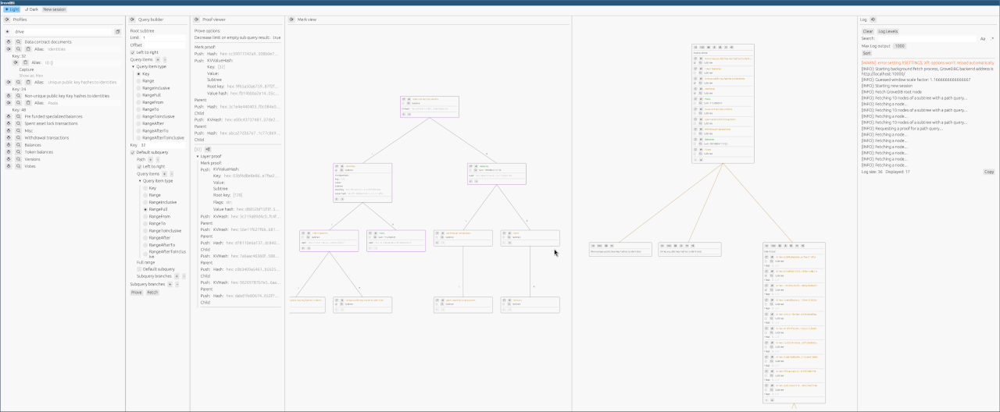
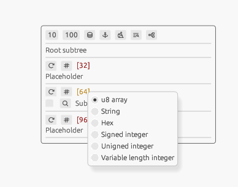
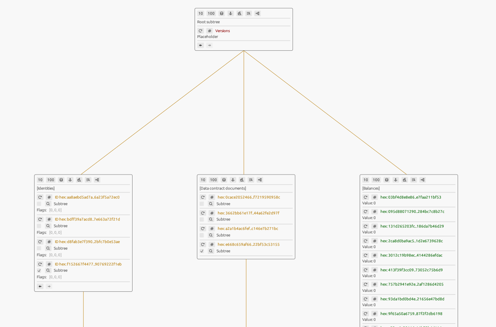

# GroveDBG
_[GroveDB](https://www.grovedb.org/) visualization application_

---

## Accessing GroveDBG

### In the browser

Recent versions of GroveDB include the GroveDBG tool, meaning that if your application uses the GroveDB library with
the `grovedbg` feature enabled and has an instance of it, the current application state is easily accessible via your
web browser:

```rust
let db = Arc::new(GroveDb::open("db")?); // Make sure the handle is `Arc`ed

db.start_visualizer(10000);
```

Then, using a WebGL-compatible browser (basically any modern one), navigate to `localhost` with a chosen port. In the
example above, it's `localhost:10000`.

### Native app

In the case of a native app, the GroveDBG frontend is no longer served by GroveDB itself, so this requires the
GroveDBG code locally. However, this still requires a running GroveDB instance with the `grovedbg` feature and the
`start_visualizer` call to fetch data from.

```
git clone https://github.com/dashpay/grovedbg.git 
cd grovedbg
GROVEDBG_ADDRESS=http://localhost:10000/ cargo run --release
```

As before, this assumes that the GroveDB instance of interest is running locally and the `start_visualizer(port)` call
used `10000` as the port. It's worth pointing out that the usage of GroveDBG is not limited to local instances and is
suitable for remote access as long as all these conditions are met and the port is open for access.

## Usage

### Overview

<details>
  <summary>Whole window screenshot</summary>

  Don't mind this tiny picture; the details are unnecessary. The goal is to show the vertical division into sections and
  count them (there should be 6).

  <picture>
    <source media="(prefers-color-scheme: dark)" srcset="docs/overview_dark.png">
    <source media="(prefers-color-scheme: light)" srcset="docs/overview_light.png">
    
  </picture>
</details>

At the top of the main (and only) GroveDBG window, there is a panel to choose the theme and start a new session. More on
sessions later, but on launch, it will start a new session automatically, so we can do without this button for now.

The rest of the window is far more fascinating: 6 vertically divided sections. We'll name them from left to right with a
brief description; details will follow later:

#### 1. Profiles

A customizable and persistent subsystem to set up shortcuts, aliases, or default byte representations.

#### 2. Query builder

A recursive form to build any query that GroveDB supports. With buttons at the end of the form, the query can be used to
fetch data or to fetch a proof.

#### 3. Proof viewer

If the query builder is used to fetch a proof, it will be shown here. Starting with the root layer, all lower layers can
be expanded as well.

#### 4. Merk view

A view of an individual subtree in the form of a merkelized AVL tree. Because trees can be really big, it starts with
the root node and provides controls to fetch and show child nodes individually.

If the query builder was used to fetch a proof and the chosen subtree is one of the proof layers, then the proof data
will be shown on top of the Merk view, highlighting the Merkle path with a color.

#### 5. Subtree view

While other panels have an arrow on top to hide them, the subtree view is considered the default view and stays visible
at all times. GroveDB is made of subtrees, and the root subtree is the first thing we'll see on GroveDBG startup.

#### 6. Log

A log window.

### Byte representations

At its core, GroveDB uses byte key-value tables arranged in hierarchies, making few assumptions about what this data
means. That's why, to make the most of it, GroveDBG is packed with features to ease the use and investigation of data in
the most sensible way for the user's domain.

Bytes can mean anything, and we give tools to choose how to represent them. By default, GroveDBG uses heuristics to
choose the appropriate display for received bytes, but this can easily be overridden.

This feature is used almost _everywhere_ in the application, which is why we introduce it early. To access it, use
__right mouse click__ on any data (key/value/bytes input).

<details>
  <summary>Root subtree with display choice menu</summary>
  <picture>
    <source media="(prefers-color-scheme: dark)" srcset="docs/root_subtree_dark.png">
    <source media="(prefers-color-scheme: light)" srcset="docs/root_subtree_light.png">
    
  </picture>
</details>

### Subtree view

The subtree view is the primary navigation area for GroveDB's structure and remains uncollapsed at all times.

<details>
  <summary>Subtrees example</summary>
  <picture>
    <source media="(prefers-color-scheme: dark)" srcset="docs/subtrees_dark.png">
    <source media="(prefers-color-scheme: light)" srcset="docs/subtrees_light.png">
    
  </picture>
</details>

Each node in this acyclic graph represents an individual subtree within GroveDB. The parent-child relationships are
displayed vertically, with subtrees appearing lower in the hierarchy indicating deeper levels within the HADS. Orange
lines illustrate connections between parents and their respective children.

These nodes consts of vertically split sections.

#### Controls

1. __10__ : fetch first 10 items of the subtree;
2. __100__ : fetch first 100 items of the subtree;
3. 
4. 
5. 
6. 
7. 

#### Path

#### Element*

#### Pagination controls

